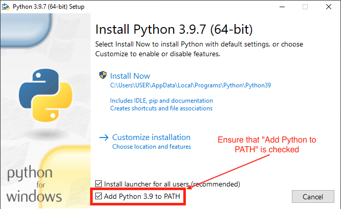

# Projeto de Animação com Tiras de LED em Arduino

Este projeto consiste na criação de uma animação usando tiras de LED controladas por um Arduino. A animação será exibida na forma de padrões de luzes sequenciais, proporcionando um efeito visual interessante.

* * *

## Componentes Necessários

* Arduino Uno
* Tira de LED RGB endereçável
* Cabos de conexão
* Fonte de alimentação para a tira de LED
* Protoboard (opcional)
* Montagem do Circuito

Conecte a tira de LED RGB ao Arduino. Certifique-se de seguir as instruções do fabricante para a correta conexão dos pinos de dados, alimentação e aterramento.
Conecte a fonte de alimentação à tira de LED, respeitando as especificações de voltagem e corrente necessárias.

Se estiver utilizando uma protoboard, faça as conexões entre o Arduino, a tira de LED e a fonte de alimentação na protoboard para facilitar a organização dos fios.

* * *

## Instalação

Instale os programas:

Instale a extensão PlatformIO:

Se o computador ficar muito lento desinstale o Vscode e instale o Sublime Text:

Instale o python (tenha certeza de adicionar o python a suas variaveis de ambiente):

Instale o PlatformIO via pip:

`pip install -U platformio`

* * *

## Execução

Para executar o código usando o PlatformIO, siga as etapas abaixo:

Certifique-se de ter o PlatformIO instalado no seu ambiente de desenvolvimento. Você pode instalá-lo como uma extensão no Visual Studio Code ou como um plugin para outros editores de texto.

Crie um novo projeto do PlatformIO ou abra um projeto existente que esteja configurado para o seu ambiente de desenvolvimento.
No diretório do projeto, navegue até a pasta "src" e crie um novo arquivo chamado "main.cpp".
Copie o código do programa para o arquivo "main.cpp".

Verifique se o arquivo "platformio.ini" está presente na raiz do projeto. Esse arquivo contém as configurações do projeto.
Abra o arquivo "platformio.ini" e verifique se a placa Arduino correta está selecionada nas configurações do ambiente (por exemplo, board = uno).

Conecte o Arduino ao seu computador por meio do cabo USB.

No PlatformIO, abra o terminal embutido ou um terminal externo na pasta do projeto.
Execute o comando pio run para compilar o código e verificar se há erros.
Após a conclusão da compilação sem erros, execute o comando

`pio run --target`

upload para enviar o código compilado para o Arduino.

Aguarde o término do processo de upload e verifique se o código foi executado com sucesso no Arduino.
Certifique-se de que o PlatformIO esteja configurado corretamente com as bibliotecas necessárias para o controle da tira de LED, como a biblioteca FastLED. Se você não tiver instalado as bibliotecas, você pode adicioná-las ao arquivo "platformio.ini" na seção `[env:nome_do_ambiente]` usando a diretiva lib_deps, por exemplo:

* * *

## Data Final 📆

20/08/2023
